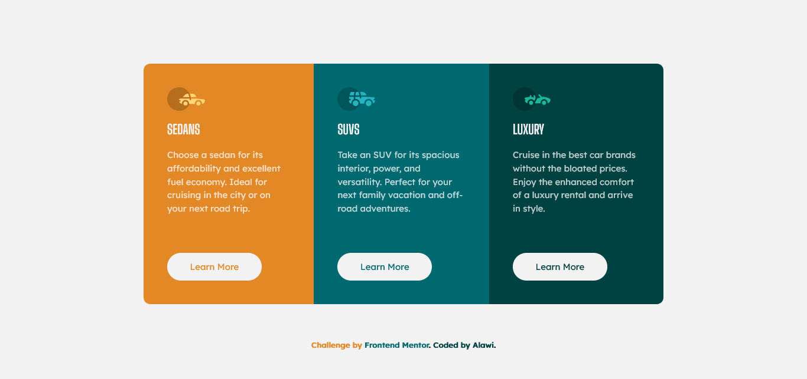

# Frontend Mentor - 3 Column preview card component solution

This is a solution to the [3 Column preview card component challenge on Frontend Mentor](https://www.frontendmentor.io/challenges/3column-preview-card-component-pH92eAR2-). Frontend Mentor challenges help you improve your coding skills by building realistic projects.

## Table of contents

- [Overview](#overview)
  - [Screenshot](#screenshot)
  - [Links](#links)
- [My process](#my-process)
  - [Built with](#built-with)
- [Author](#author)

## Overview

### Screenshot

### Desktop

### Mobile

### Links

- Solution URL: [Solution]()
- Live Site URL: [Live Site]()

## My process

### Built with

- Semantic HTML5 markup
- CSS Grid
- Flexbox
- Mobile-first workflow

## Author

- Frontend Mentor - [@alawi17](https://www.frontendmentor.io/profile/alawi17)
